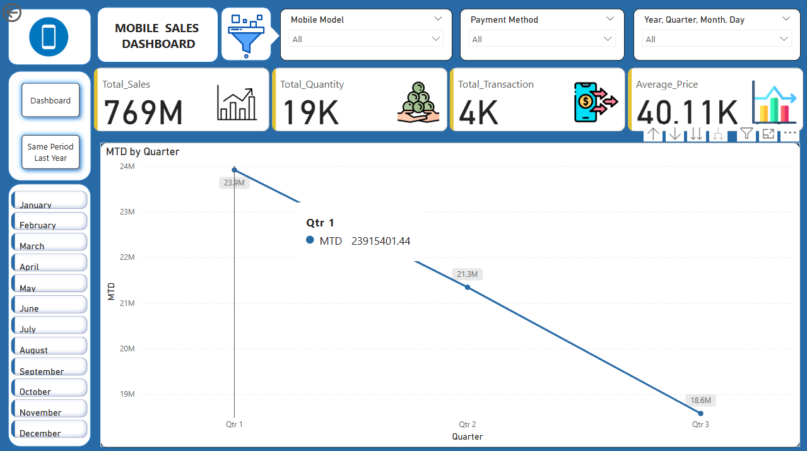
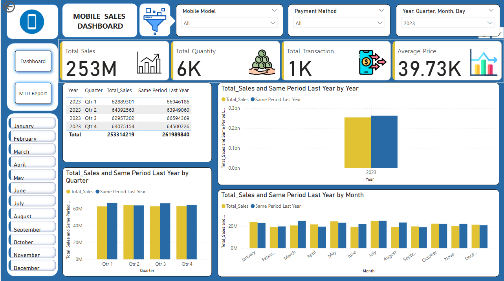

# Power BI Mobile Sales Dashboard

## Project Overview
This project is a Power BI dashboard created to analyze mobile sales data.
It provides insights into sales performance, revenue trends, and regional analysis.

## Tools Used
- Power BI
- Excel/CSV
- Power Query

## Key Insights
- Total sales and revenue trends
- Top-performing regions and brands
- Monthly and yearly sales comparison

## Dataset
The dataset used in this project is available in the `dataset` folder.
File: `Mobile Sales Data.xlsx`

## Dashboard Preview

